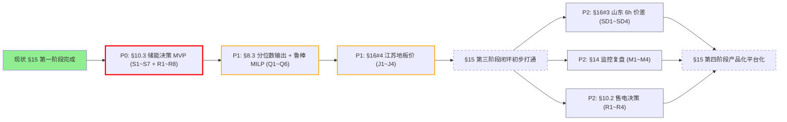

# 后续工作清单（对齐公司指南 V1.0）

> 本清单基于《[公司电力市场预测与决策模型研发计划及管理指南 V1.0](公司电力市场预测与决策模型研发计划及管理指南_V1.0.md)》对 `price_forecast_benchmark` 工程的进度盘点而成，按指南章节组织待办，按 §15 阶段 + §16 优先级排序。
>
> 每完成一项请在勾选框前加 `[x]`，并在 `RESULTS.md` 同步追加证据（实验结果 / 文件路径 / commit hash）。

---

## 0. 当前进度评分（截至 2026-05-26）

按指南条款逐项对齐：

| 指南条款 | 状态 | 证据 / 缺口 |
|---|---|---|
| §6 数据分层、版本、可用时点 | ✅ 已做 | `config/markets/*.yaml` + `runs/data/` + Feature Registry |
| §7 特征版本管理 | ✅ 已做 | `pfbench/feature_registry.py` + yaml `features.groups` |
| §8.1 五层基准（朴素+业务+ML+主模型+事后参考） | ✅ 5/5 | naive ✓ / ML ✓ / Conv2D ✓ / PF（储能完全预知）✓ |
| §8.3 模型输出标准（P10/P50/P90/高价概率/置信度等） | ❌ 未到位 | 预测 CSV 只有 `ts/actual/predicted` |
| §9.1 点预测指标 | ✅ 已做 | MAE/RMSE/MAPE/Bias/QuantileLoss |
| §9.2 形态指标 | ✅ 已做 | profile_corr / peak_time / spread / direction_acc / neg_corr_day_ratio |
| §9.3 场景识别指标 | ✅ 已做 | high/low recall&precision、extreme_day |
| **§9.4 决策收益指标** | ✅ 已做 | `pfbench/storage/revenue.py` → `metrics.json["decision_metrics"]` |
| §10.3 储能日前充放电辅助决策 | ✅ 已做 | `pfbench/storage/` + `scripts/run_storage_eval.py` |
| §10.2 售电公司决策模型 | ❌ 未到位 | 依赖客户负荷画像数据，本工程暂无该数据源 |
| §11 仓库结构 | ✅ 基本到位 | `algorithms/` + `pfbench/` + `runs/` + `scripts/` + `config/` |
| §12 实验记录 | ✅ 已做 | `experiment_id` + `experiment_config.json` + `metrics.json` |
| §14 监控复盘 | ❌ 未到位 | 无日/周/月监控机制 |
| §18 交付物标准（10 份） | ⚠ 1/10 | 仅有 `RESULTS.md` 横向比较文档 |

**整体定位**：本工程已完成 §15 第一阶段，第二阶段（形态/极端指标）进行中，**第三阶段（储能决策 MILP）已启动**（红井 2h 参数，三市场 15min 评估）。

---

## 1. 待办清单（按指南章节）

### 1.1 §10.3 储能决策模型 — 优先级 P0

对应指南 §16 项目 2"独立储能日前充放电辅助决策模型（内蒙、江苏、太仆寺旗、泰兴）— 高优先级"。

实施方案见 `.cursor/plans/移植储能决策与收益计算_55f0a44d.plan.md`。

- [x] **S1**　新建 `pfbench/storage/` 包：`battery.py` / `milp.py` / `revenue.py` / `plot.py` / `report.py` / `runner.py`
- [x] **S2**　三市场 yaml 加 `storage:` 节（`settlement_price_col` + 电池参数）
- [x] **S3**　CLI `scripts/run_storage_eval.py`，扫描 `runs/predictions/<market>/<algo>/` 自动跑储能评估
- [x] **S4**　smoke + 逐日对账：v8.0 hourly 预测 105 天 vs 内蒙 HiGHS 参考实现 diff=0
- [x] **S5**　三市场×7 算法 15min 全跑（21 任务），输出 `runs/storage/`
- [x] **S6**　naive 三策略储能评估已纳入
- [x] **S7**　`RESULTS.md` §8 储能决策与收益评估 + MAE≠收益分析

**验收标准**：
- 三市场×N 算法都有 `total_net / vs_pf_pct / vs_heuristic_pct` 三项
- naive 三策略也跑储能并入对比表
- 至少 1 个市场的某算法跑出"MAE 排名"与"收益排名"不一致的现象（用于说明决策评估的必要性）

---

### 1.2 §9.4 决策收益指标完整化 — 优先级 P0（与 S1 同步做）

指南 §9.4 列了 9 项，原 plan 只覆盖 3 项。在 `pfbench/storage/revenue.py` 内一次性补齐：

- [x] **R1**　`positive_day_ratio`
- [x] **R2**　`max_drawdown_abs` / `max_drawdown_pct`
- [x] **R3**　`var_5pct` / `var_1pct`
- [x] **R4**　`cvar_5pct` / `cvar_1pct`
- [x] **R5**　`regret_vs_pf_abs` / `regret_vs_pf_pct` / `realization_rate`
- [x] **R6**　`infeasible_days` / `n_timeout` / `n_zero_solution`
- [x] **R7**　`mean_daily_net` / `std_daily_net` / `sharpe_annual`
- [x] **R8**　`metrics.json["decision_metrics"]`（arbitrage + with_comp 两组）

**验收标准**：所有 `runs/storage/<market>/<algo>/metrics.json` 都含 §9.4 全套 9 项指标。

---

### 1.3 §8.3 模型输出标准 — 优先级 P1

让预测算法吐分位数到 CSV，前置打通 rosbust MILP（基于 P10/P50/P90 的鲁棒求解）。

- [ ] **Q1**　LightGBM-TwoStage：把内置 `quantile_mode` 默认打开，预测 CSV 增加 `pred_q10/pred_q25/pred_q50/pred_q75/pred_q90` 五列
- [ ] **Q2**　Conv2D-MultiTask：加分位数 head（或残差 bootstrap），输出同上五列
- [ ] **Q3**　LightGBM-Baseline：加单独的分位数模式（fit 三个独立的 quantile LightGBM）
- [ ] **Q4**　`pfbench/storage/runner.py` 检测到分位数列存在时，自动启用 `solve_day_milp_15min_robust(alpha=0.3/0.5/0.7)`，与点预测 MILP 横向比较
- [ ] **Q5**　扩展指标 `qloss_q10/q50/q90`（指南 §9.1）已经在 `pfbench/metrics.py` 有定义，但目前预测 CSV 没分位数列所以没计算；Q1/Q2/Q3 完成后回填
- [ ] **Q6**　`RESULTS.md` §7"分位数预测与鲁棒 MILP 对比"

**验收标准**：
- 三个 ML 算法在三市场×2 粒度下都能输出分位数 CSV
- robust MILP 在江苏 / 重庆（短训练集 / 远期分布漂移市场）至少有一个市场的 net_revenue 比点预测 MILP 高 ≥5%

---

### 1.4 §16 项目 4 — 江苏地板价与价格形态研究 — 优先级 P1

指南 §16 第 4 项明确点名江苏地板价分析。本工程当前江苏 1h/15min 三个 ML 算法**全部劣于 7 日均值零线**，且 `low_recall` 极低（TwoStage single-pass 仅 0.012），说明地板价识别正是江苏的关键瓶颈。

- [ ] **J1**　统计江苏 test 区间地板价占比、连续地板价段长度分布、地板价成因（与新能源出力 / 负荷的相关性）
- [ ] **J2**　新增 `algorithms/jiangsu_floor_classifier/`：专门做"地板价 / 非地板价"二分类，可基于 LightGBM
- [ ] **J3**　把地板价分类器作为现有算法的后处理（when prob > τ, predict = floor_value），评估对 MAE / 储能收益的双重影响
- [ ] **J4**　`doc/江苏地板价专题研究报告.md` —— 对应指南 §18 交付物 8"业务应用说明"

**验收标准**：江苏 ML 算法 MAE 至少有一个降到零线之下；地板价 recall 从 < 0.05 提升至 > 0.3。

---

### 1.5 §16 项目 3 — 山东实时电价 6h 提前预测与价差风险 — 优先级 P2

依赖山东数据接入，**当前本工程无山东数据源**。

- [ ] **SD1**　与数据团队对接山东省现货数据（日前价 / 实时价 / 边界），形成 `runs/data/shandong/...`
- [ ] **SD2**　新增 `config/markets/shandong.yaml`，定义 D+6h 实时预测的 `test_start/test_end`、target、settlement
- [ ] **SD3**　移植 / 实现三个基准算法在山东上的 6h 提前预测
- [ ] **SD4**　价差 (DA - RT) 方向预测的辅助任务，对应指南 §9.3"价差方向准确率"

**验收标准**：山东 6h 提前 RT 价格预测 MAE / 价差方向 acc 双指标进入 `RESULTS.md`。

---

### 1.6 §10.2 售电公司报价与采购风险决策 — 优先级 P2（远期）

指南 §16 项目 1。**依赖客户负荷画像数据**（用户级用电曲线 / 合同结构），当前本工程无该数据源。

- [ ] **R1'**　调研：是否能从重庆 / 山东项目拿到至少一个虚拟客户的负荷曲线
- [ ] **R2'**　实现 §10.2.1 用户风险画像（稳定基荷型 / 尖峰暴露型 / 波动型 / 可调节型 / 高风险型五分类）
- [ ] **R3'**　实现 §10.2.2 零售套餐报价测算（固定价 / 联动 / 分时 / 保底分成）
- [ ] **R4'**　实现 §10.2.3 批发采购比例优化（保守 / 平衡 / 激进 / 风险约束四种）

**验收标准**：先达到 R1' / R2'（数据 + 用户画像），再决定是否继续 R3' / R4'。

---

### 1.7 §14 模型监控与复盘机制 — 优先级 P2

指南 §14 要求日 / 周 / 月监控。当前本工程无任何监控机制。

- [ ] **M1**　新增 `scripts/monitor_daily.py`：每天读取最新数据、跑现有所有算法的当日预测、与基准对比、输出当日报告
- [ ] **M2**　新增 `scripts/monitor_weekly_review.py`：跑过去一周的指标漂移检测（MAE / Profile Corr / 收益 vs 历史平均）
- [ ] **M3**　告警阈值：MAE 漂移 > 20% / 收益跌幅 > 30% / 极端价格漏报率 > 50% 触发警告
- [ ] **M4**　`doc/模型监控与复盘指南.md`

**验收标准**：能在测试环境跑一周连续的日报，并能识别出至少一个真实的漂移事件（or 反例：一周内全部稳定）。

---

### 1.8 §18 交付物标准 — 优先级 P3（贯穿）

指南 §18 列了 10 份正式交付物。当前本工程只有 `RESULTS.md`。建议每个市场建立 `doc/market_<id>/` 子目录，包含：

- [ ] **D1**　《模型需求说明书》（每市场一份，含业务场景、target、test 区间、评价指标）
- [ ] **D2**　《数据字典与口径说明》（每市场一份，字段含义、可用时点、缺失处理）
- [ ] **D3**　《特征清单》（已部分覆盖于 yaml + Feature Registry，整理为 markdown）
- [ ] **D4**　《模型训练配置》（已有 `experiment_config.json`，加 README 说明字段）
- [ ] **D5**　《模型评估报告》（即 `RESULTS.md`，已有）
- [ ] **D6**　《预测结果文件》（即 `runs/predictions/`，已有，加目录 README）
- [ ] **D7**　《决策回测报告》（依赖 §10.3 储能 + 后续售电）
- [ ] **D8**　《业务应用说明》（每市场一份）
- [ ] **D9**　《代码与运行说明》（即 `README.md`，已有）
- [ ] **D10**　《模型风险与适用边界说明》（每模型一份，含训练数据范围、不适用场景、已知失败模式）

**验收标准**：每个市场至少有完整的 D1 / D2 / D8 / D10 四份；其余可由代码 + 现有文档间接覆盖。

---

## 2. 推荐实施顺序（按 §15 阶段 + §16 优先级）



**短期 1~2 周**：完成 P0（储能决策 MVP，对应 S1~S7 + R1~R8 共 15 个 todo）

**中期 3~6 周**：P1（分位数 + 鲁棒 MILP + 江苏地板价）

**长期**：P2/P3（山东 / 监控 / 售电 / 交付物补齐）

---

## 3. 与指南条款的双向溯源

每完成一项 todo，建议在 commit message 中标注对应指南条款，例如：

```text
feat(storage): 接入 §10.3 + §9.4 决策收益指标 (R1~R8)
exp(jiangsu): §16#4 地板价分类器 baseline (J2)
docs: §18#D1 重庆模型需求说明书
```

便于后续按"指南视角"做横向追溯。

---

## 4. 更新日志

| 日期 | 更新内容 |
|------|----------|
| 2026-05-26 | 基于指南 V1.0 对当前进度的盘点而成；列出 P0 储能、P1 分位数 / 江苏地板价、P2 山东 / 监控 / 售电四个层次共 ~30 个 todo |
