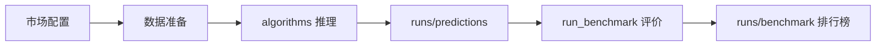

# 规范测试流程

描述「从原始数据到排行榜」的可重复步骤；机器可读配置在 `config/pipelines/`。

## 目标流程

当前已实现 **E**（`scripts/run_benchmark.py`）；**B–C** 在 `algorithms/` 与 `scripts/run_pipeline.py` 中逐步补齐。

## 与外部工程的关系

- **外部**：各 `*_prj` 自行训练，本工程只读其 `output/`（`--sources external`）。
- **本仓**：在 `algorithms/` 研发，预测落在 `runs/predictions/`（`--sources local`）。
- **合并对比**：`--sources all`（默认）同时评价两类来源，排行榜用 `source` 列区分。
